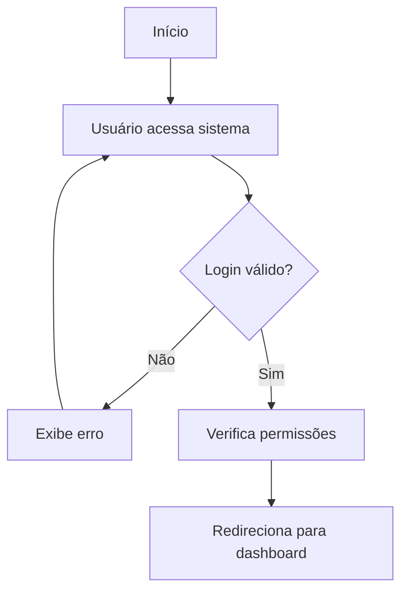
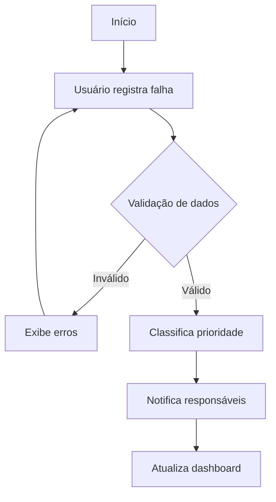
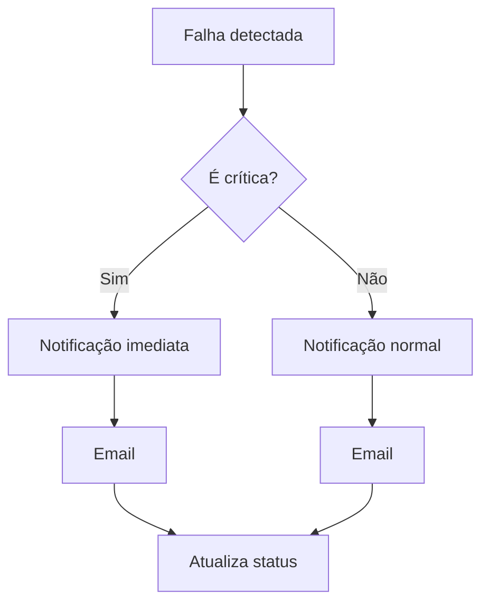
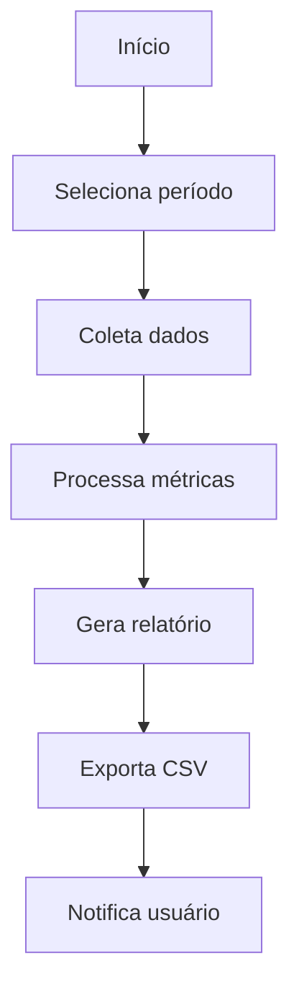

# HydroBattery - Sistema de Gerenciamento de Falhas de Energia

Sistema desenvolvido em C# para gerenciamento e monitoramento de falhas de energia em data centers e instalações críticas.

## Objetivo do Projeto

O HydroBattery tem como objetivo principal fornecer uma solução robusta e confiável para o gerenciamento de falhas de energia em instalações críticas, permitindo:

- Monitoramento em tempo real de falhas de energia
- Rastreamento de impactos financeiros e operacionais
- Geração de relatórios detalhados para análise
- Notificação imediata de eventos críticos
- Gestão eficiente de recursos técnicos

## Requisitos Funcionais

1. **Autenticação e Autorização**
   - Login com diferentes níveis de acesso (Admin, Técnico, Usuário)
   - Gerenciamento de permissões por nível
   - Registro de atividades de usuário

2. **Gestão de Falhas**
   - Cadastro de novas falhas
   - Atualização de status
   - Registro de ações corretivas
   - Categorização de falhas
   - Priorização automática

3. **Monitoramento**
   - Dashboard em tempo real
   - Alertas configuráveis
   - Histórico de eventos

4. **Relatórios**
   - Geração de relatórios personalizados
   - Exportação em CSV
   - Análise de tendências

## Requisitos Não Funcionais

1. **Performance**
   - Tempo de resposta < 2 segundos
   - Suporte a múltiplos usuários simultâneos

2. **Segurança**
   - Logs de auditoria
   - Backup automático

3. **Usabilidade**
   - Interface intuitiva
   - Documentação completa

4. **Manutenibilidade**
   - Código modular
   - Testes automatizados
   - Documentação técnica

## Tecnologias Utilizadas

- **Backend**
  - .NET 9.0
  - C# 12.0

- **Ferramentas de Desenvolvimento**
  - Visual Studio 2022
  - Git

## Regras de Negócio

1. **Gestão de Falhas**
   - Falhas críticas devem ser notificadas imediatamente
   - Cada falha deve ter um responsável designado
   - Falhas não podem ser fechadas sem descrição da solução
   - SLA máximo de 4 horas para falhas críticas

2. **Cálculos e Métricas**
   - Impacto financeiro = (Tempo de falha * Custo por hora)
   - Impacto em usuários = (Tempo de falha * Usuários afetados)
   - Prioridade = (Gravidade * Urgência * Impacto)

3. **Notificações**
   - Níveis: INFO, ALERTA, ERRO, CRÍTICO, SUCESSO
   - Canais: Console, Email
   - Agendamento de notificações recorrentes

4. **Relatórios**
   - Geração diária automática
   - Retenção de 12 meses
   - Exportação em CSV
   - Validação de dados antes da exportação

## Fluxogramas

### Fluxo de Autenticação


### Fluxo de Registro de Falha


### Fluxo de Notificação


### Fluxo de Geração de Relatório


## Requisitos

- .NET 9.0 SDK
- Visual Studio 2022 ou VS Code

## Como Executar

1. Clone o repositório
2. Abra o terminal na pasta do projeto
3. Execute `dotnet run`
4. Faça login com as credenciais:
   - Admin: admin/1234
   - Técnico: tecnico/senha

## Estrutura do Projeto

```
HydroBattery/
├── Models/         # Classes de domínio
├── Services/       # Serviços e lógica de negócio
├── Data/          # Repositório e acesso a dados
├── Utils/         # Classes utilitárias
└── Tests/         # Testes do sistema
```

## Testes do Sistema

O sistema inclui uma suíte completa de testes automatizados que cobrem todas as funcionalidades principais. Para executar os testes, faça login e selecione a opção "Executar Testes" no menu principal.

### Cobertura de Testes

1. **Autenticação e Usuários**
   - Login com credenciais válidas
   - Login com credenciais inválidas
   - Criação de novo usuário
   - Validação de usuário duplicado
   - Verificação de roles (Admin, Técnico, User)

2. **Cadastro de Falhas**
   - Registro de falha válida
   - Validação de datas (início/fim)
   - Validação de campos obrigatórios
   - Detecção de alertas críticos
   - Cálculo de duração

3. **Relatórios**
   - Falhas por dia
   - Duração média de falhas
   - Impacto financeiro total
   - Falhas por tipo
   - Falhas críticas
   - Status das falhas
   - Impacto por local

4. **Exportação de Dados**
   - Exportação para CSV
   - Validação do formato do arquivo
   - Verificação do cabeçalho
   - Validação dos dados exportados
   - Criação automática de diretórios

5. **Gerenciamento de Falhas**
   - Atualização de status
   - Busca por status
   - Busca por local
   - Busca por período
   - Cálculo de impactos financeiros
   - Cálculo de impacto em usuários

6. **Sistema de Logs**
   - Registro de logs
   - Exibição de logs
   - Limpeza de logs
   - Validação do arquivo de log
   - Formatação de mensagens

7. **Sistema de Notificações**
   - Notificações no console
   - Notificações em arquivo
   - Diferentes tipos de notificação (INFO, ALERTA, ERRO, CRÍTICO, SUCESSO)
   - Formatação colorida no console
   - Validação de arquivos de notificação

8. **Validações de Entrada**
   - Validação de strings não vazias
   - Validação de números inteiros positivos
   - Validação de datas/horas
   - Validação de tipos de falha
   - Tratamento de entradas inválidas

### Relatório de Testes

Ao executar os testes, o sistema gera um relatório detalhado que inclui:
- Total de testes executados
- Número de testes com sucesso
- Número de testes com falha
- Taxa de sucesso em porcentagem
- Lista detalhada de testes com falha (incluindo mensagens de erro)
- Lista de todos os testes com sucesso

## Contribuição

1. Faça um fork do projeto
2. Crie uma branch para sua feature (`git checkout -b feature/nova-feature`)
3. Commit suas mudanças (`git commit -m 'Adiciona nova feature'`)
4. Push para a branch (`git push origin feature/nova-feature`)
5. Abra um Pull Request

## Licença

Este projeto está sob a licença MIT. Veja o arquivo [LICENSE](LICENSE) para mais detalhes. 